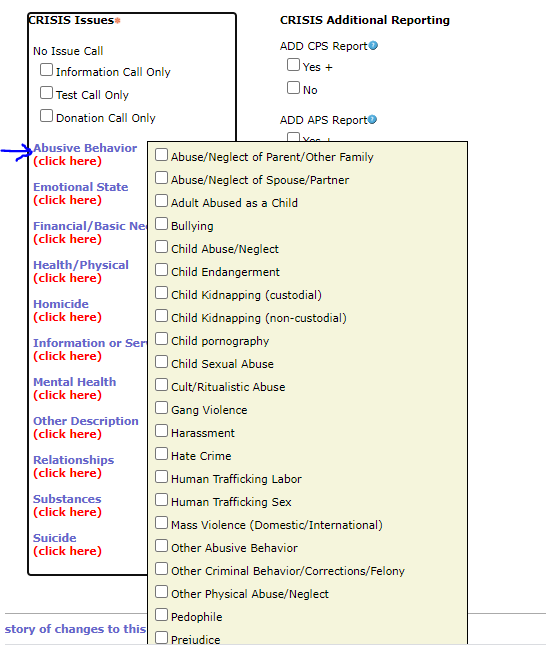

# Family and Children Services Crisis Calls

[Family and Children Services of Nashville](http://www.fcsnashville.org/) operates a Crisis Call Center. When calls come in, call takers use a form to indicate the various issues the individual is experiencing: 

For individuals experiencing multiple issues, the issues are grouped together into a single cell, making analysis of individual issues challenging. Our class was tasked with parsing data from various 'CRISIS Issues` columns to allow deeper investigation of each individual issue. From there, we were asked to explore, analyze and visualize the data to help FCS gain insight into their data. 

## MVP
A google sheets presentation of analysis and recommendations.

## My Role

This was a full class project completed with real data from a real client. While I did perform some analysis, I also worked in a project management capacity for this project. It was my job to set class deadlines, schedule presentation walk-throughs, and ensure quality, consistency, completeness, and logical flow in our presentation.

### Technologies Used
*Python*: Data cleaning, exploration, analysis and visualization 
*Google Slides*: Team presentation building

### View full presentation here: 
https://docs.google.com/presentation/d/1U8pDqJKAgDxHVWJ8IbSdn6qSXbZSjWYTULHHYax6SzI/edit#slide=id.gcf1e2bfac2_0_71

  (Presentation is also available in this repo as a pdf)

